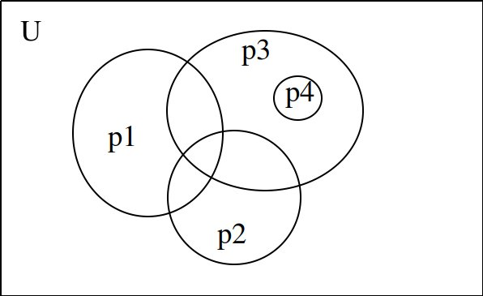

# F. Coprime Subsequences

From [Educational Codeforces Round 20](https://codeforces.com/contest/803)

給定一個序列，問有幾個子序列的 gcd == 1。

## 解法

**Mobius Function**


```c++
ll sp[M], mobius[M];
void sieve()
{
    for(ll i = 0; i < M; i++) sp[i] = i;
    for(ll i = 2; i*i < M; i++) if(sp[i] == i) 
    {
        for(ll j = i*i; j < M; j += i) 
            if(sp[j] == j) sp[j] = i;
    }
}
void makeMobius()
{
    for(ll i = 0; i < M; i++) mobius[i] = 1;
    mobius[0] = 0;
    for(ll i = 2; i < M; i++) if(sp[i] == i)
    {
        for(ll j = i; j < M; j += i) mobius[j] = -mobius[j];
        for(ll j = i*i; j < M; j += i*i) mobius[j] = 0;
    }
}
```

**cnt(x)** = 整個序列中有幾個元素可以被 **x** 整除

**f(x)** = **x** 可以整除的子序列數量 = 2^**cnt(x)**-1

解法：$\sum_{i=1}^{M} f(i) \mu (i)$

----

算**cnt(x)**

```c++
// cnt[x] = 序列中有幾個 x
ll c = 0;
for(int j = i; j < M; j+=i) c += cnt[j];
// cnt(i) = c
```

算所有 square free number **c** 時間複雜度：

> **Q(x)** = number of square free number in **[1,x]** = **6x/pi/pi**
> sum(1/1 + 1/2 + ... + 1/x) = log(x)
>
> 大約是 x

-----

考慮只有三個質數 **p1, p2, p3** 的狀況：



所求 = **U** - **p1 U p2 U p3** = **U** - (**f(p1) + f(p2) + f(p3)**) + (**f(p1p2) + f(p2p3) + f(p1p3)**) - (**f(p1p2p3)**)

考慮另一個數字 **p4** = **p3 x p3 x** 某數，那 **p4** 能整除的子序列一定是 **p3** 能整除的子序列的子集。所以不用算(不然會重複算到)。

會發現 **f(x)** 和他前面的係數有這樣的關係：

- 如果 **x** 有一或多個重複的質因數，他的係數一定是 **0**
- 如果 **x** 為奇數個相異質數乘積，他的係數一定是 **-1**
- 如果 **x** 為奇數個相異質數乘積，他的係數一定是 **1**

這個係數就是 Mobius Function